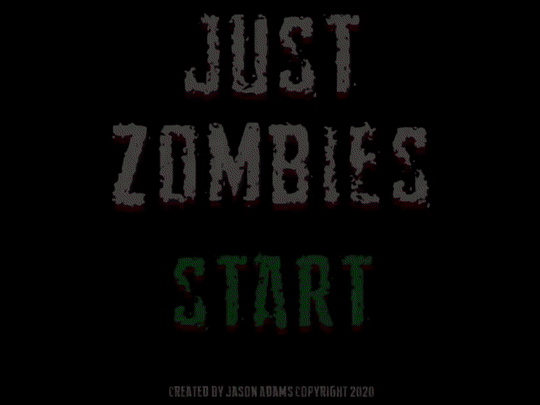
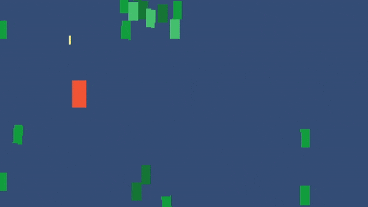
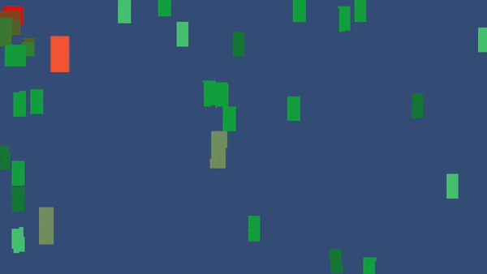

# just-zombies

## GGggaarrrghlllh!

A lo-fi, short (tiny!) survival horror based on the arena shooting genre. Can you survive 60 seconds in a zombie apocalypse?

### How to play

WASD to move. HJKL to fire. Shoot zombies, survive an apocalypse!

If you're using a gamepad, left-stick moves while controller buttons (typically XYAB) shoot. Same rules!

### Action

 

#### Nerds

* A COVID-19 lockdown project that took a few days to write.
* Unity, ECS/DOTS based game.
  * The project also includes free Unity Store assets.
* Gameplay inspiration from The Binding of Isaac and Thomas Was Alone (read: I am not an artist).
* Featured in the Two-Minute Horror Game Jam: https://itch.io/jam/two-minute-horror-jam
